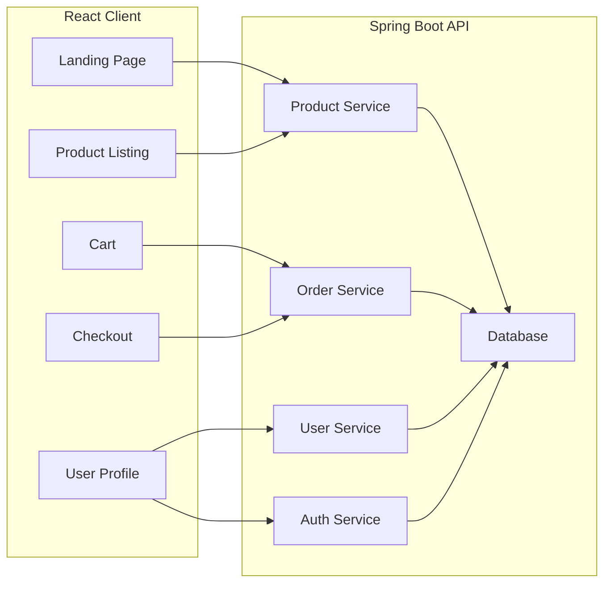
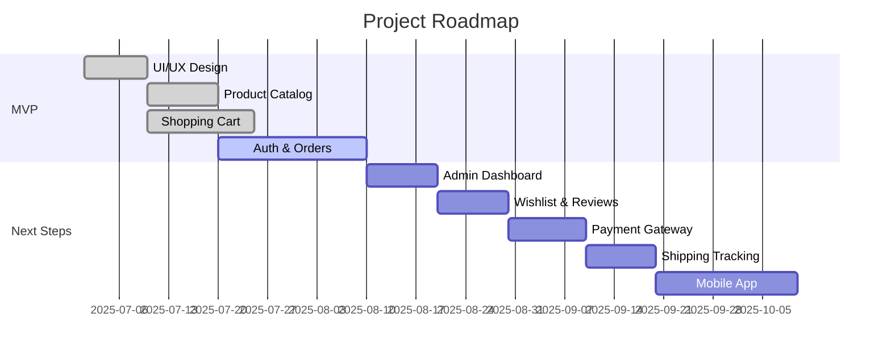

# 🚀 ecom-react-springboot

Welcome to **ecom-react-springboot** – a full-stack e-commerce platform built with **React** (frontend) and **Spring Boot** (backend)!  
Experience a blazing-fast shopping journey, scalable architecture, and modern developer workflow.

---

## 📸 Screenshots & Demo

| Home Page                | Product View               | Cart & Checkout            |
|--------------------------|---------------------------|----------------------------|
|  |  |   |


<details>
  <summary>More UI Previews</summary>

  
  
</details>

---

## 🎥 Demo Video

[](https://www.youtube.com/watch?v=your-demo-video-id)

---

## 🚦 Badges


---

## 🏃 Quick Links

- [Getting Started](#getting-started)
- [Features](#features)
- [Architecture](#architecture-overview)
- [Tech Stack](#tech-stack)
- [Contributing](#contributing)
- [FAQ](#faq--troubleshooting)
- [API Docs](#api-documentation)
- [Roadmap](#roadmap)
- [Community](#community--contacts)
- [License](#license)

---

## ✨ Features

| Feature                  | Status    | Description                          |
|--------------------------|-----------|--------------------------------------|
| Responsive UI/UX         | ✅        | Modern React design, mobile-ready    |
| Product Catalog          | ✅        | Browse, search, filter products      |
| Shopping Cart            | ✅        | Add, update, remove items            |
| User Authentication      | ✅        | Secure login/register (JWT)          |
| Order Management         | ✅        | Place, track, view orders            |
| RESTful API              | ✅        | Spring Boot backend services         |
| SQL Database             | ✅        | Data persistence, fast queries       |
| Docker Support           | ✅        | Easy setup for dev/prod              |
| Testing & Coverage       | ⚡        | Jest/React + JUnit coverage          |
| Admin Dashboard          | 🕒        | Analytics, management                |
| Wishlist & Reviews       | 🕒        | Save favorites, leave reviews        |
| Live Chat & Support      | 🕒        | Customer support/chatbot             |
| Payment Gateway          | 🕒        | Stripe/PayPal integration            |
| Shipping Tracking        | 🕒        | Real-time delivery status            |
| Mobile App               | 🔮        | React Native version planned         |
| Theme Customizer         | 🕒        | User-selectable themes/colors        |
| OAuth/Social Login       | 🕒        | Google, Facebook, etc.               |
| Internationalization     | 🕒        | Multi-language support               |

🕒 = Planned | 🔮 = Future

---

## 🌲 Folder Structure

```
ecom-react-springboot/
├── client/               # React frontend
├── springboot-backend/   # Spring Boot backend
├── shared/               # Shared configs & assets
├── public/               # Static files
├── sql/                  # SQL scripts & migrations
├── .builder/             # Build configs
├── .metadata/            # Metadata
├── AGENTS.md             # AI/Agent info
├── README.md             # This file!
├── SPRING_BOOT_BACKEND_PLAN.md # Backend roadmap
├── package.json          # Node dependencies
├── index.html            # Entry point
├── vite.config.js        # Vite config
└── ...                   # Other config files
```

---

## 🏗️ Architecture Overview



---

## 🧑‍💻 Tech Stack

| Layer        | Technology           | Purpose                    |
|--------------|---------------------|----------------------------|
| Frontend     |  | UI, SPA, state management  |
| Backend      |  | RESTful API, business logic|
| Database     |   | Data storage               |
| DevOps       |  | Containerization, deployment|
| Bundler      |   | Fast builds                |
| Testing      |  +  | Test coverage              |

---

## 🛠️ Getting Started

### Prerequisites

- [Node.js](https://nodejs.org/) & npm
- [Java](https://www.java.com/) & Spring Boot
- [Docker](https://www.docker.com/) (optional)
- [MySQL/Postgres](https://www.postgresql.org/) (or your preferred SQL DB)

### Setup

```sh
# Clone repository
git clone https://github.com/Prasad-Bhumkar/ecom-react-springboot.git

# Install frontend dependencies
cd client
npm install
npm run dev

# Run backend
cd ../springboot-backend
./mvnw spring-boot:run
```

### Docker Compose (Recommended)

```sh
docker-compose up --build
```
_Edit `docker-compose.yml` for DB credentials or ports as needed._

---

## 🧪 Testing & Coverage

- **Frontend:** `npm test` (Jest, React Testing Library)
- **Backend:** `mvn test` (JUnit)
- Coverage reports generated in `/coverage` directory.
- [Codecov badge above shows latest coverage stats.]

---

## 🧹 Code Quality

- **Frontend:** ESLint, Prettier
- **Backend:** Checkstyle, SpotBugs
- Auto-format on commit via husky hooks.

---

## 🔒 Security

- JWT-based authentication
- HTTPS recommended for deployment
- Environment variables for secrets (`.env`)
- Regular dependency audits

---

## 📖 API Documentation

- [OpenAPI/Swagger UI](http://localhost:8080/swagger-ui/) _(running locally)_
- [Live Docs](https://your-live-swagger-url)

---

## 🤝 Contributing

We love your input!  
Check [CONTRIBUTING.md](CONTRIBUTING.md) for guidelines, branching strategy, code style, and PR process.

1. Fork the repo
2. Create your feature branch (`git checkout -b feature/amazing-feature`)
3. Commit your changes (`git commit -m 'Add amazing feature'`)
4. Push to the branch (`git push origin feature/amazing-feature`)
5. Open a Pull Request

See [SPRING_BOOT_BACKEND_PLAN.md](SPRING_BOOT_BACKEND_PLAN.md) for backend ideas.

---

## ❓ FAQ & Troubleshooting

<details>
  <summary>Expand for common questions</summary>

**Q:** API is not connecting to frontend  
**A:** Check CORS config in backend and proxy settings in `client/package.json`.

**Q:** Database migration failures  
**A:** Ensure your DB server is running, credentials match, and SQL scripts are applied.

**Q:** Docker build fails  
**A:** Try `docker-compose down` then `docker-compose up --build`. Check logs for missing env variables.

**Q:** How to reset test data?  
**A:** Run SQL scripts in `/sql` or use provided admin endpoints.

**Q:** Need more help?  
**A:** Open a [GitHub Issue](https://github.com/Prasad-Bhumkar/ecom-react-springboot/issues).

</details>

---

## 🗺️ Roadmap



---

## 🗃️ Changelog

See [CHANGELOG.md](CHANGELOG.md) for major updates and releases.

---

## 🌐 Community & Contacts

- [Discord](https://discord.gg/your-community-link)
- [Slack](https://join.slack.com/your-community-link)
- [Discussions](https://github.com/Prasad-Bhumkar/ecom-react-springboot/discussions)
- [Twitter](https://twitter.com/yourprofile)
- [Contact](mailto:your@email.com)

---

## 🙏 Acknowledgements

- [React](https://react.dev/)
- [Spring Boot](https://spring.io/projects/spring-boot)
- [Docker](https://www.docker.com/)
- [Vite](https://vitejs.dev/)
- [All contributors](https://github.com/Prasad-Bhumkar/ecom-react-springboot/graphs/contributors)
- Inspired by [awesome-ecommerce-projects](https://github.com/topics/ecommerce)

---

## 📄 License

© 2024 Prasad Bhumkar. All rights reserved.

This project is a personal creation and is protected under applicable copyright laws.  
Unauthorized copying, distribution, modification, or use of this project or its contents by any means is strictly prohibited without explicit written permission from the author.

For licensing inquiries or permissions, please contact: your@email.com

---


<!--
Replace image URLs, API docs, and community links with your actual resources for best results!
-->
